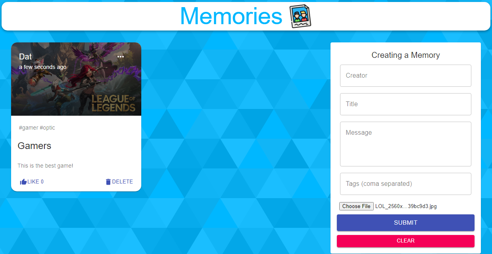

<!-- PROJECT SHIELDS -->
<!--

<!-- PROJECT LOGO -->
<br />
<div align="center">
    
</div>

<!-- ABOUT THE PROJECT -->
## About The Project
<p>Memories is a MERN stack project and it is a social media app where user can make post, delete posts, and like posts. Currently, there is no user authentication function and it is being build at the moment using GoogleAuth.
The page is being deployed on <a href="https://socialmemories.netlify.app" target='_blank'>Netlify</a></p>

### Built With


<br />

<br />

<br />

<!-- GETTING STARTED -->
## Getting Started

You can either view this app using the deployment link or the follow the steps below to run it in your local environment.

### Prerequisites

* npm
  ```sh
  npm install npm@latest -g
  ```

### Installation

1. Clone the repo
   ```sh
   git clone https://github.com/github_username/repo_name.git
   ```
2. Install NPM packages
   ```sh
   npm install --legacy-peer-deps
   ```
3. Change the baseUrl in /client/src/api/index.js from Heroku to your localhost port for the backend
   ```js
   const API = axios.create({ baseURL: 'http://localhost:YOUR-PORT-NUMBER' });
   ```
4. Change the script of /server/package.json
   ```js
    "scripts": {
    "start": "nodemon index.js"
  },
   ```   
5. Run the back end server
 ```sh
   npm start
   ```
6. Run the front end page
 ```sh
   npm start
 ```
<!-- USAGE EXAMPLES -->
## Usage

Use this space to show useful examples of how a project can be used. Additional screenshots, code examples and demos work well in this space. You may also link to more resources.

_For more examples, please refer to the [Documentation](https://example.com)_

<!-- CONTACT -->
## Contact

Your Name - [@twitter_handle](https://twitter.com/twitter_handle) - email@email_client.com
